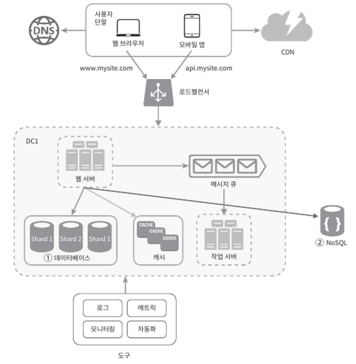

# DNS

도메인 이름으로 IP 주소 조회

# 데이터 베이스
  - 분류
    + Relational Database
      + 자료를 열, 칼럼으로 표현
      + 여러 테이블에 있는 데이터를 join 하여 합칠 수 있음
      + 오랜시간 검증된 방식 
      + MySQL, Oracle, PostgresSQL 등 
      + NoSQL 
    + 비 관계형 데이터 베이스
      + Key-value / graph / column store 등 
      + Join 연산 지원하지 않음
      + 낮은 응답 지연 시간과 아주 많은 양을 저장할 때 용이

  - 다중화
    + 데이터 베이스 사이에 master – slave 관계를 설정
    + 쓰기 연산은 master에서만 읽기 연산은 slave에서만
    + 병렬로 처리될 수 있는 쿼리의 수가 늘어나므로 성능 좋아짐
    + 데이터 베이스의 가용성과 안정성이 증가

  - 규모 확장
    + 수직적 확장
      + 고성능의 자원을 증설하는 방법이지만 한계가 있고 단일 실패 지점으로 인한 위험성이 크다
    + 수평적 확장
      + Sharding 이라고도 함
      + 모든 샤드는 같은 스키마를 쓰지만 보관되는 데이터는 중복이 없음
      + 샤딩 키에 따라 분류 

# 로드 밸런서
  - 웹 서버들에게 트래픽 부하를 고르게 분산하는 역할
  - 보안을 위해 사설 IP주소 사용 
 
 
# 캐시
  - 자주 참조되는 데이터를 메모리 안에 두고 요청이 빠르게 처리될 수 있도록 하는 저장소
  - 데이터 베이스의 부하를 줄이기 위함
  - 캐시할 데이터 종류, 크기, 패턴, 일관성, 장애, 메모리 크기 등을 고려하여 맞는 전략을 선택

# CDN
  - 정적 콘텐츠 전송하는데 쓰이는 지리적으로 분산된 서버의 네트워크
  - 사용자와 지리적으로 가까운 CDN에 접속하여 데이터 받아옴
  - 비디오, css, javascript 파일 등은 웹 서버말고 CDN을 통해 제공하여 나은 성능 보장

# Stateless 웹 계층
  - 웹 계층의 수평적 확장을 위해서는 사용자 세션 데이터와 같은 상태 정보를 웹 계층에서 제거 해야 함
  - 상태 정보를 DB에 보관하고 필요할 때 마다 가져옴
  - 사용자로부터의 요청은 어떤 웹서버로 전달되어도 정상적으로 동작
  - 트래픽 양에 따라 웹 서버를 넣거나 빼면 자동으로 규모를 확장할 수 있음

# 데이터 센터
  - 지리적 라우팅, geoDNS, 사용자의 위치에 따라 가장 가까운 데이터 센터로 라우팅
  - 데이터 센터마다 데이터 동기화, 데이터 다중화 

# 메시지 큐
  - 메시지의 무손실을 보장하는 비동기 통신을 지원하는 컴포넌트
  - 생산자가 메시지를 만들어 큐에 발행하면 구독자가 메시지를 받아 동작을 수행
  - 서버간 결합이 느슨해져 안정적 서비스를 구현하기 좋음

# 로그, 메트릭
  - 시스템 운영에 필요한 정보 수집

