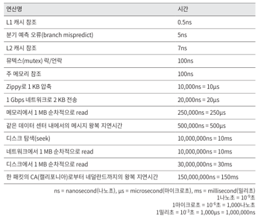

# 응답 지연 값

  - 메모리는 빠르지만 디스크 연산은 느리다
  - 단순한 압축 알고리즘은 빠르다
  - 데이터를 인터넷으로 전송 전에는 압축하라
  - 고가용성이란 시스템이 오랜 시간동안 지속적으로 중단 없이 운영될 수 있는 능력을 지칭
  - 대부분의 시스템은 99 ~ 100% 사이의 값을 갖는다

# 팁
  - 근사치를 활용하여 계산
  - 가정들은 메모
  - 단위를 붙여라
  - 연습 많이 
